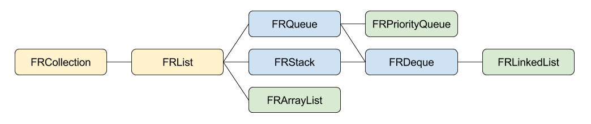

# FRUtils - A Java-like collection of utilities for Objective-C

## Background
When switching form Java to Objective-C, I found that many classes that I was using in Java do not have an easy to use equivalent in ObjectiveC. This library provides Java-like classes such as [ArrayList](https://docs.oracle.com/javase/7/docs/api/java/util/ArrayList.html), [LinkedList](https://docs.oracle.com/javase/7/docs/api/java/util/LinkedList.html) and [PriorityQueue](https://docs.oracle.com/javase/7/docs/api/java/util/PriorityQueue.html) which can make the transition easier.

## Hierarchy


## Java Equivalents
| Objective-C | Java
| ----------- | ----
| [FRCollection](FRUtils/FRCollection.h) | [java.util.Collection](https://docs.oracle.com/javase/7/docs/api/java/util/Collection.html)
| [FRList](FRUtils/FRList.h) | [java.util.List](https://docs.oracle.com/javase/7/docs/api/java/util/List.html)
| [FRQueue](FRUtils/FRQueue.h) | [java.util.Queue](https://docs.oracle.com/javase/7/docs/api/java/util/Queue.html)
| [FRStack](FRUtils/FRStack.h) | [java.util.Stack](https://docs.oracle.com/javase/7/docs/api/java/util/Stack.html)
| [FRDeque](FRUtils/FRDeque.h) | [java.util.Deque](https://docs.oracle.com/javase/7/docs/api/java/util/Deque.html)
| [FRArrayList](FRUtils/FRArrayList.h) | [java.util.ArrayList](https://docs.oracle.com/javase/7/docs/api/java/util/ArrayList.html)
| [FRLinkedList](FRUtils/FRLinkedList.h) | [java.util.LinkedList](https://docs.oracle.com/javase/7/docs/api/java/util/LinkedList.html)
| [FRPriorityQueue](FRUtils/FRPriorityQueue.h) | [java.util.PriorityQueue](https://docs.oracle.com/javase/7/docs/api/java/util/PriorityQueue.html)

## Challenges
Objective-C does not support automatic boxing and unboxing for primitive data types. While using `NSNumber` can be used for converting from and to numbers, the resulting code is a little bit too complex for its purpose. Consider adding and getting an integer from a list:

```
FRList* list = [FRList list];
[list add:[NSNumber numberWithInt:1];
int val = [(NSNumber*)[list get:0] intValue];
```

To address this, the library makes extended use of protocols (one for each supported primitive data type), making it possible to write this:

``` objective-c
id<FRListWithInt> = [FRList list];
[id addIntValue:1];
val2 = [id getIntValue:0];
```

## Usage
The classes in this library are following the API exposed by their Java equivalents. See Java documentation for usage.
Example:

```
FRList* list = [FRArrayList list];
[list add:someObject];
[list remove:someObject];
```

### Primitive Data Types
The following primitive data types are supported:
* `int`
* `NSInteger`
* `float`
* `double`

The names of the methods used for working with primitive data types match the methods in `NSNumber`: `[NSNumber withXXX]`.
Example:

```
FRList* list = [FRArrayList list];
[list addIntegerValue:someNSInteger];
[list removeIntegerValue:someNSInteger];
```
